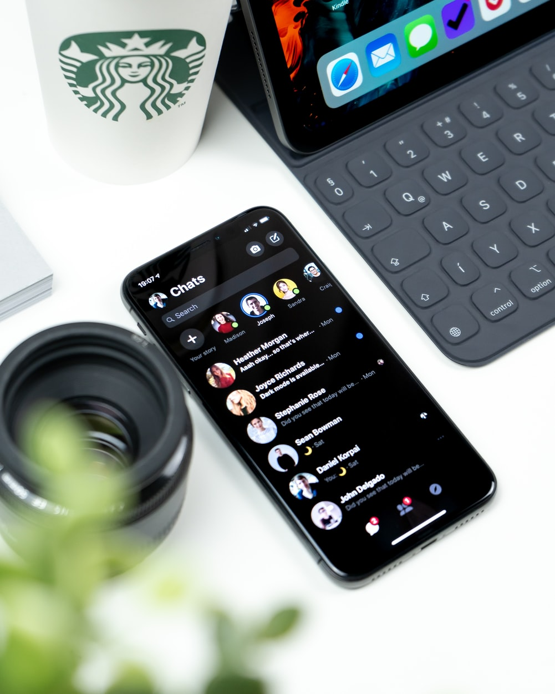

# chatbot

ChatBots are conversational agents, programs capable of conducting a conversation with an Internet user. In this project we implemented [WhatsApp](./whatsapp/) and [Facebook Messenger](./messenger/) chatbots using [Twilio](https://www.twilio.com) plateform.

In addition to static chatbots, we also benefited from the power of Google's [Dialogflow](https://dialogflow.cloud.google.com/) to create intelligent bots, capable of understanding human languages

