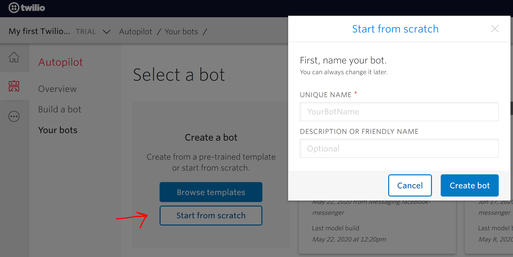
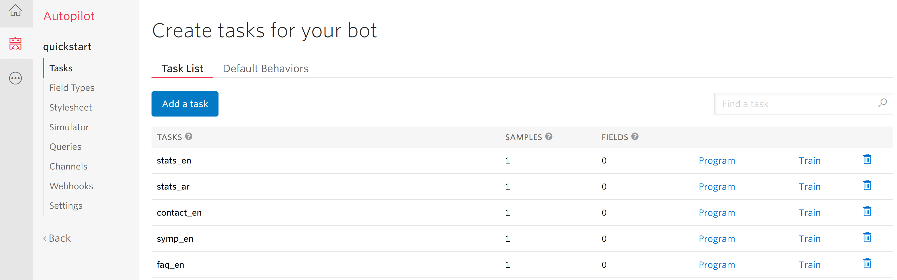
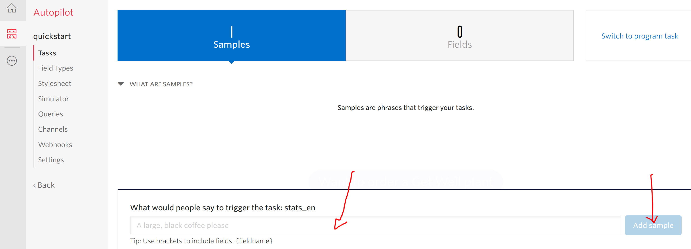
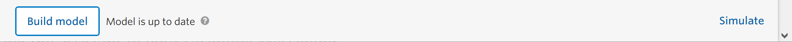
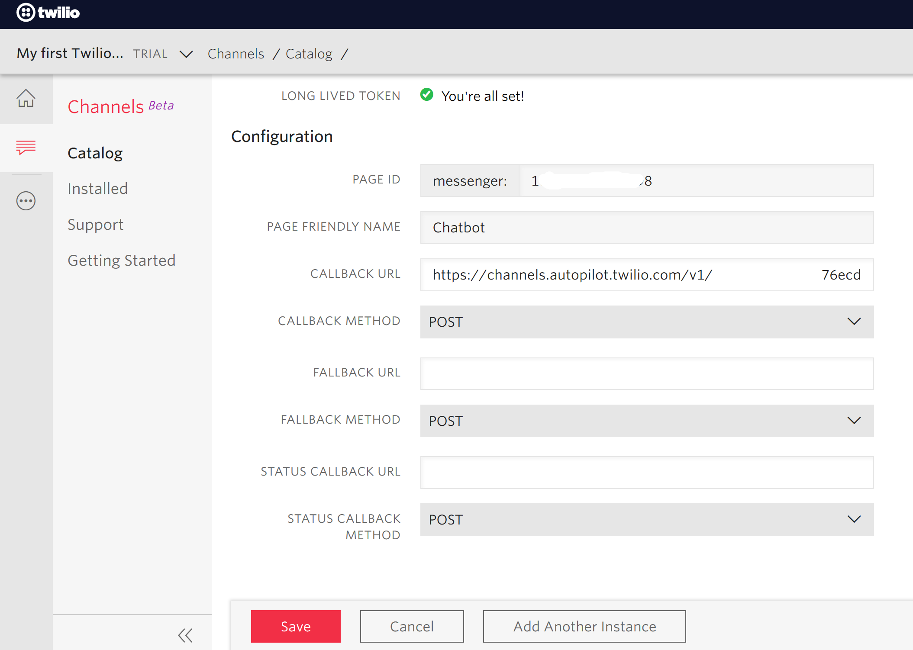

# Messenger Chatbot

<p>

  
[Messenger](https://www.messenger.com) is an American messaging app and platform developed by Facebook, it enables users to send messages and exchange photos, videos, stickers, audio, and files. 

In this project we will build a Messenger Chatbot using Twilio Autopilot.
</p>


## Twilio

<p align="center">

</p>

[Twilio](https://www.twilio.com) is a cloud communications platform as a service (CPaaS) company which allows software developers to programmatically make and receive phone calls, send and receive text messages, and perform other communication functions using its web service APIs.

Before starting this project, make sure you have a Facebook Page for your brand or business, and the Messenger App installed in your phone. If so, the following steps will walk you through the process of creating and configuring your Facebook Messenger channel on Twilio, and then to link it with your FB page :

Make sure you have created an Autopilot assistant to power the Facebook Messenger Bot.

## Create and configure the Autopilot assistant

**1.** Create a [Twilio account](https://www.twilio.com/try-twilio)

**2.** Create a [new project](https://www.twilio.com/console/projects/create)
      
**3.** On project console, open **Autopilot**, then create a new bot _from scratch_ if you don't have one.



**4.** In the dashboard of your bot, select _Tasks_ on the left menu. 

A bot usually has many tasks that power it. These could be simple tasks like _confirm_ or _cancel_ or more complex tasks like _make-a-reservation_

**5.** Click on _Add a task_ and give it a (meaningful) name. Create as many tasks as your bot have to handle.

Every task has two main features _Program_ and _Train_



* **Program** : Helps you program the actions your bot will perform in a given task. You need to replace the JSON text with your proper needs. for instance if you want to answer by a static text, change the text after **"say" :** by whatever you want your bot to say when this task is called :

```
{
    "actions": [
        {
            "say": "Hello, how can I help you?"
        }
    ]
}
```

If you want to execute a distant code or call an API :

```
{
	"actions": [
		{
			"redirect": "PUT THE URL HERE"
		}
	]
}
```

* **Train** : Click on this button to add the expressions that will trigger this task. Add as many samples as possible so that your bot can map human input to the task.



:warning: DO NOT FORGET to click **BUILD MODEL** whenever you make changes to your bot



## Link the assistant to your Facebook page 

**1.** Go to [Twilio's Facebook channel](https://www.twilio.com/console/channels/XB93e989ba4b741738f51c3f0e12076d42) and click _install_ to install the Facebook Messenger channel on your Twilio account.

**2.** In the _Configure_ section, select _Properties_ > _Use in_ > _Programmable SMS Inbound_

**3.** Go to _Credentials_ and click the _Facebook Log in_ button and follow the instructions to link your Facebook page with your Twilio Account.

**4.** If all goes well, after selecting your Facebook page you'll see most of the Configuration fields auto-populate below. We only have one main field left : _Callback URL_

* Go back to your assistant ( [Autopilot Console](https://www.twilio.com/console/autopilot/) > your assistant )
	
* Select _Channels_ > _Facebook Messenger_. In the _Configuration_ section, you will see the URL we are looking for, copy it

* Go back to the FB Messenger Configuration page and paste that URL on the _Callback URL_ field

**5.** _Save_ your configuration, and go to Messenger app on your mobile, search for the name of your Facebook page, and start the conversation.


