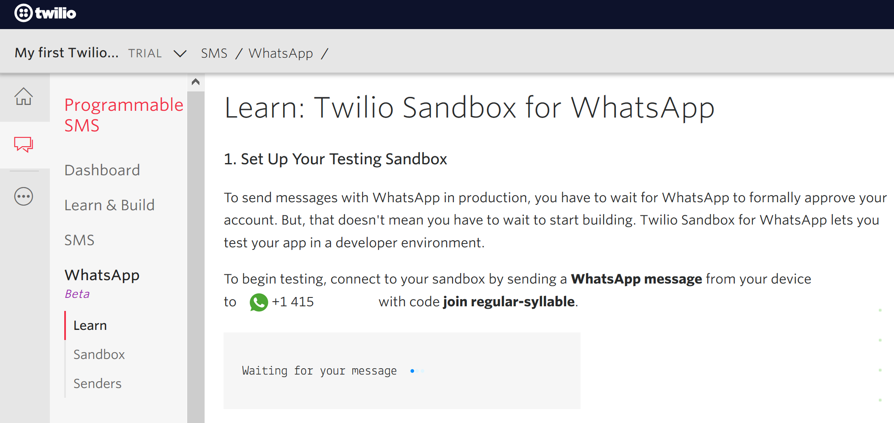

# WhatsApp Chatbot

  
WhatsApp is the most popular OTT app in many parts of the world. Thanks to whatsapp chatbots you can provide your customers with support on a platform they use and answer their questions immediately.

Using _Twilio, Flask_ and _Heroku_, as well as many other advanced platforms like _DialogFlow_, we can build amazing chatbots as we will do in this project.

## Twilio

Twilio is a cloud communications platform as a service (CPaaS) company which allows software developers to programmatically make and receive phone calls, send and receive text messages, and perform other communication functions using its web service APIs.

With the Twilio API for WhatsApp, you can send notifications, have two-way conversations, or build chatbots. 

For free, and without waiting for your Twilio number to be approved for WhatsApp, Twilio Sandbox for WhatsApp enables you to create your chatbot immediately as we are about to see in this project .

**1.** Create a [Twilio account](https://www.twilio.com/try-twilio)

**2.** Create a [new project](https://www.twilio.com/console/projects/create)
      
**3.** On project console, open Programmable SMS Dashboard

**4.** Select WhatsApp Beta

When you activate your sandbox, you will see the phone number associated with it (here **+1 415 ...**) as well as its name (here **regular-syllable**)

## Create the application using _Flask_

## Get a public address to the app using _Ngrok_

## Get rid of your machine and use _Heroku_

## Advanced chatbots
