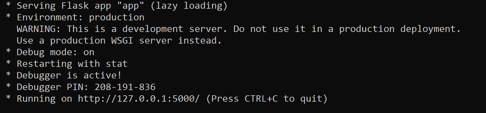

# WhatsApp Chatbot

<p>

  
WhatsApp is the most popular OTT app in many parts of the world. Thanks to whatsapp chatbots you can provide your customers with support on a platform they use and answer their questions immediately.

Using _Twilio, Flask_ and _Heroku_, as well as many other advanced platforms like _DialogFlow_, we can build amazing chatbots as we will do in this project.
</p>

## Twilio

<p align="center">

</p>

Twilio is a cloud communications platform as a service (CPaaS) company which allows software developers to programmatically make and receive phone calls, send and receive text messages, and perform other communication functions using its web service APIs.

With the Twilio API for WhatsApp, you can send notifications, have two-way conversations, or build chatbots. 

For free, and without waiting for your Twilio number to be approved for WhatsApp, Twilio Sandbox for WhatsApp enables you to create your chatbot immediately as we are about to see in this project .

**1.** Create a [Twilio account](https://www.twilio.com/try-twilio)

**2.** Create a [new project](https://www.twilio.com/console/projects/create)
      
**3.** On project console, open Programmable SMS Dashboard

**4.** Select WhatsApp Beta


When you activate your sandbox, you will see the phone number associated with it (here **+1 415 ...**) as well as its name (here **regular-syllable**)

## Create the application using _Flask_

**1.** Create a new virtual environment :

  * In a new folder open terminal and execute : `python -m venv myvenv`
 
**2.** Activate your virtual environment :
  
  * Windows : `myvenv\Scripts\activate`
    
  * Linux   : `source myvenv/bin/activate`
    
**3.**  Install these two Python packages : 

  * [Twilio](https://www.twilio.com) : `pip install twilio`
  
  * [Flask](https://flask.palletsprojects.com)  : `pip install flask` <sup>[1](#myfootnote1)</sup>
    
**4.** Create a Flask App : 

In your folder, create a file named _app.py_ then _copy&paste_ the following code : 

```
from flask import Flask, request
from twilio.twiml.messaging_response import MessagingResponse

app = Flask(__name__)

@app.route("/")
def hello():
    return "Hello, World!"

@app.route("/sms", methods=['POST'])
def sms_reply():
    """Respond to incoming calls with a simple text message."""
    # Fetch the message
    msg = request.form.get('Body')

    # Create reply
    resp = MessagingResponse()
    resp.message("You said: {}".format(msg))

    return str(resp)

if __name__ == "__main__":
    app.run(debug=True)
```

This is a basic flask web app which enables us to get `Hello, world!` in **/** route, and get back our message if we POST it to **/sms** route as we can see in the following steps

**5.** Run the app : `python app.py`
 


Your application is now running ..

You can check that by typing `http://127.0.0.1:5000/` in your browser. (You'll get `Hello, world!`)

However, it wouldn't be possible for distant machines to access your app, hence the need for **Ngrok**

## Get a public address to the app using _Ngrok_

[Ngrok](https://ngrok.com) will enable us to have a public URL for our application running locally.

**1.** Download [**Ngrok**](https://ngrok.com/download) and unzip it

**2.** Run it from command line by executing : `./ngrok http 5000`

**3.** Now you can access your app runnig locally from a distant machine using the provided URL (something like this `https://******.ngrok.io`)

**4.** Now you can go back to Twilio sandbox and paste it as URL for incoming messages :


**5.** You can now open WhatsApp in your phone, add the number you've got from Twilio in the [first step above](#Twilio) (**+1 415 ...**), and start the conversation by the code they told you to start with (here **join regular-syllable**)

**6.** You can now send whatever Whatsapp message you want and the bot will reply by sending back the same message. It is kind of a parrot bot :smiley:

However, we still have a major problem here, your machine should remain running all the time to allow the application to answer users' requests

## Get rid of your machine and use _Heroku_

<p align="center">

</p>

Thanks to [Heroku](https://www.heroku.com) we will be able to deploy our application, and all the requirments it needs to run effectively, in the Cloud. Hence our machine will benefit from the luxury of being turned off. To do so we need to :

**1.** In our virtual environment, install **gunicorn** <sup>[2](#myfootnote2)</sup> : `pip install gunicorn`

**2.** Create these files in your folder :
  
  * **Procfile** : then save this content in it `web gunicorn app:app`
  
  * **runtime.txt** : then save this content in it `python-3.7.2`
  
  * **requirments.txt** : You can simply type `pip freeze > requirements.txt` to fill it with all 3rd party libraries required by your app.
  
  * **.gitignore** : then save this content in it 
  
  ```
  myvenv/
  *.pyc
  ```

**3.** Download & install [Git](https://git-scm.com/downloads)<sup>[3](#myfootnote3)</sup>; then in your virtual environment:

  * Initialize a new git repository in your project folder : `git init`
  
  * Add all untracked files to git repository : `git add .`
  
  * Commit the changes to git repository : `git commit -m "first commit"`

**4.** Create a new [Heroku account](https://signup.heroku.com) if you don't have one. Then download Heroku [Command Line Interface (CLI)](https://devcenter.heroku.com/articles/heroku-cli#download-and-install) which makes it easy to create and manage your Heroku apps directly from the terminal.

**5.** Connect to your Heroku account from your virtual environment using `heroku login` then you will be forwarded to a web-based inteface in the browser to complete the authentication phase.

**6.** Create a new Heroku app. `heroku create <app-name>`

**7.** Deploy your app by pushing your local git repository to the remote Heroku app's git repository : `git push heroku master`

Finally, when the deployment is done, you will see in the terminal the address where you can reach to your app. -something like `https://<app-name>.herokuapp.com/sms`- Copy it and go back to your sandbox to replace the _Ngrok_ URL by the new _Heroku_ one


Congratulations your parrot Whatsapp Bot is now running 24/7, it does not need assistance from your machine anymore :smiley: you can turn it off.

## Update your code

Say, you come up tomorrow with another idea rather this parrot bot which you've made, all you need to do is to make the changes in your code (in the file _app.py_. You can also add more files if the project is complex) then:

```
# connect to your virtual environment
<virtual_environment_name>\Scripts\activate #Windows
source <virtual_environment_name>/bin/activate #Linux

# connect to your heroku account
heroku login 

# prepare all the modified files and send them to Heroku
git add .
git commit -m "first change"
git push heroku master
```

## Use your own number

If you want to create a serious business Whatsapp bot, the approach I presented earlier presents two drawbacks for you : 

**(1)** In order to use the bot, your clients **must** kick off the conversation with a certain message (here **join regular-syllable**); 

**(2)** The bot comes up with the logo of Twilio instead of yours. 

This is due to the fact that we used the Twilio sandbox and the number we were provided with is not ours. However, Twilio offers you the possibility to own a number and consequently get rid of the aforementionned problems. To do so, here are the steps you need to follow :

**Step 1 :** Buy a [Twilio number](https://www.twilio.com/console/phone-numbers/search)


**Step 2 :** Request access to enable your Twilio number for WhatsApp by filling out [Twilio's "Request Access" form](https://www.twilio.com/whatsapp/request-access) (make sure you have your Facebook Business Manager ID before)

When your request will be approved, Twilio will notify you by an email which will walk you through the next steps to follow for submitting your _sender Profile_ and _WhatsApp Message Templates_, then another email will show you how to _approve Twilio to send messages on your behalf_ and to _verify your Facebook Business Manager account_.

So, after sending the request, make sure you check your emails frequently for the next steps. The whole process takes 2 to 3 weeks.

[Further information about the process](https://www.twilio.com/docs/whatsapp/tutorial/connect-number-business-profile)

## Advanced chatbots

# 
<h5>
<a name="myfootnote1">1</a>: Flask is a micro web framework written in Python<br>
<a name="myfootnote2">2</a>: Gunicorn "Green Unicorn" is a Python Web Server Gateway Interface HTTP server<br>
<a name="myfootnote3">3</a>: Git is a distributed version-control system for tracking changes in source code during software development<br>
</h5>
